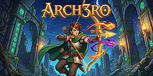
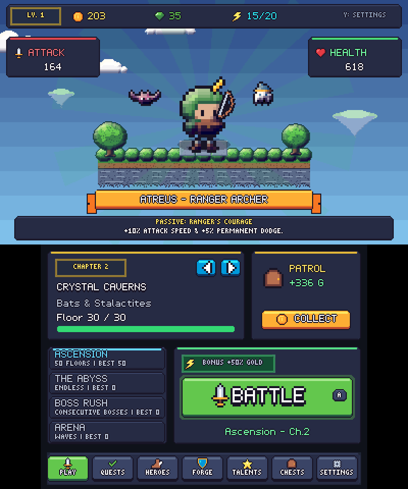
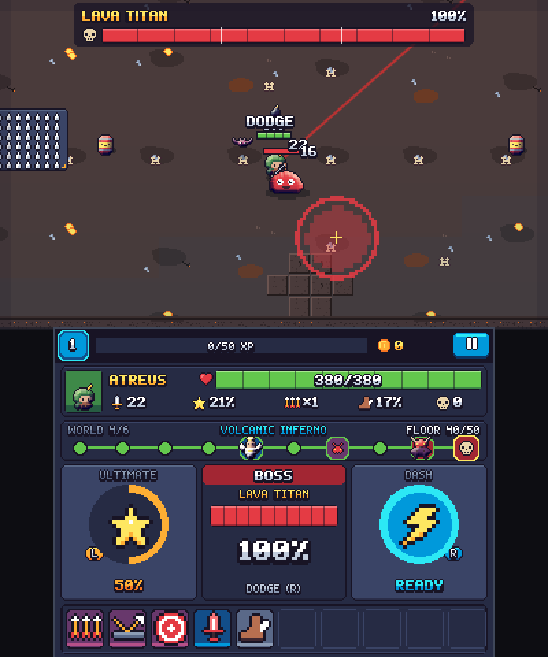
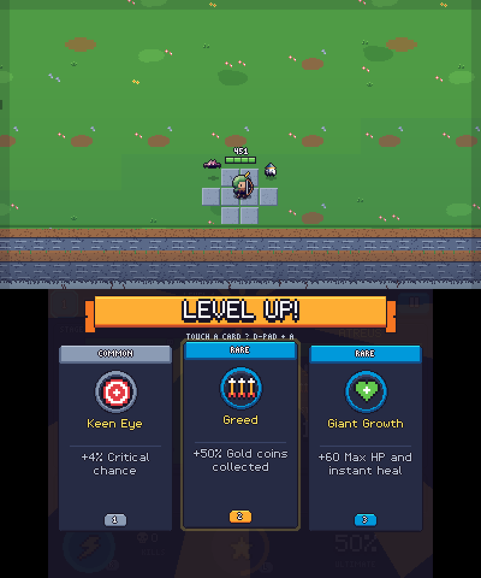
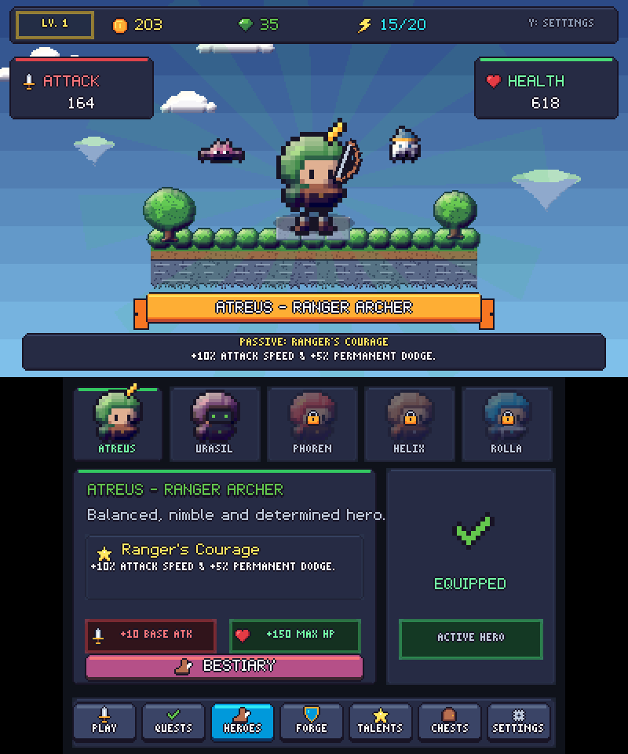
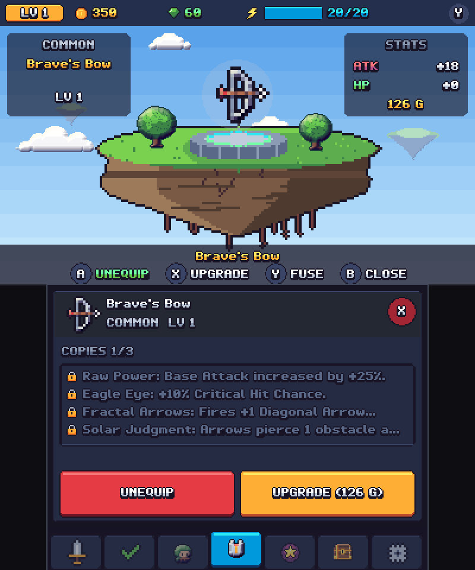
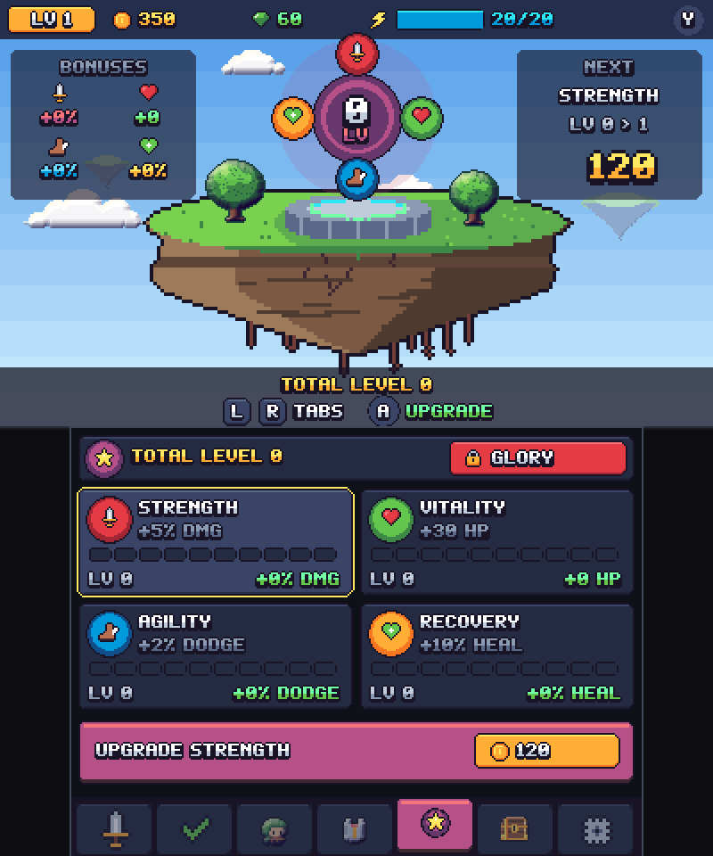
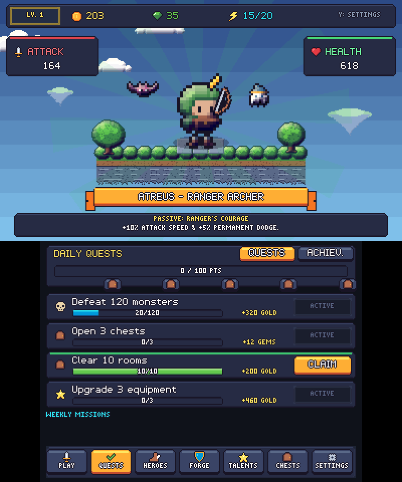
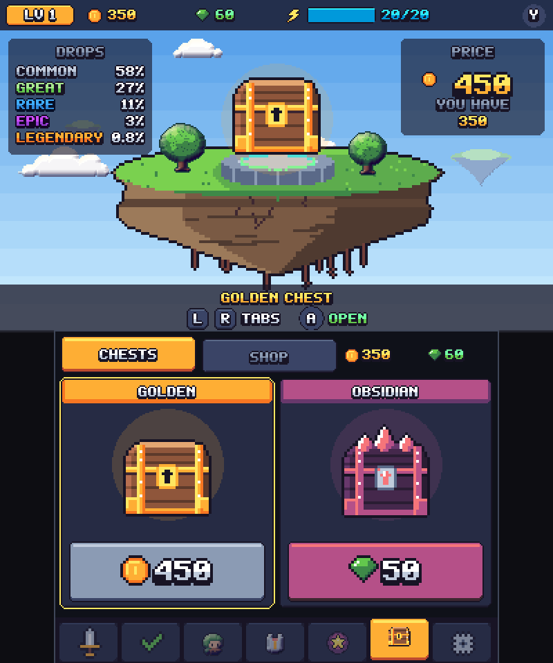
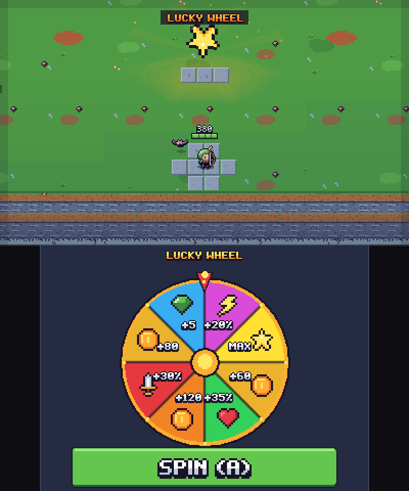

<div align="center">

# 🏹 ARCH3RO 3DS

### *An action roguelite for Nintendo 3DS & PC*

[](https://github.com/tonydetony1/arch3ro3ds)
[](https://lovebrew.org/)
[](#-3ds-technical-feats--optimizations)
[](https://github.com/tonydetony1/arch3ro3ds)
[](https://github.com/tonydetony1/arch3ro3ds/releases)
[](LICENSE)

<br/>



<p align="center">
  <b>Arch3ro 3DS</b> runs on the <b>Nintendo 3DS family</b> (Old 3DS, 2DS, New 3DS, New 2DS XL) and on <b>Desktop PC</b> (Linux, Windows, macOS via LÖVE 11.x).
</p>

[Screenshots](#-screenshots) •
[Installation Guide](#-installation-guide-3ds--pc) •
[3DS Technical Feats](#-3ds-technical-feats--optimizations) •
[Controls](#-controls--gameplay) •
[Building from Source](#-building-from-source) •
[Modding & Contributing](CONTRIBUTING.md)

</div>

---

## 📸 Screenshots

<div align="center">
  
  
  
  <br/>
  
  
  
  <br/>
  
  
  
  <br/>
  <sub><i>Captured in Azahar at Old 3DS clock — top screen above, touch screen below.</i></sub>
</div>

---

## 📦 Installation Guide (3DS & PC)

### 🎮 Nintendo 3DS Installation

#### Method 1: QR Code via FBI (Recommended)
1. Turn on Wi-Fi on your Nintendo 3DS.
2. Launch **FBI** from your HOME Menu.
3. Select **Remote Install** ➔ **Scan QR Code**.
4. Scan the release QR code below (or from our [Latest Releases](https://github.com/tonydetony1/arch3ro3ds/releases)):

<div align="center">
  
  <br/>
  <sub><i>Scan with FBI to install directly to HOME Menu</i></sub>
</div>

#### Method 2: Manual `.CIA` Install (HOME Menu)
1. Download `Arch3ro.cia` from the [Latest Releases](https://github.com/tonydetony1/arch3ro3ds/releases).
2. Copy `Arch3ro.cia` to `sdmc:/cias/` on your 3DS SD card.
3. Open **FBI**, navigate to `SD` ➔ `cias/` ➔ `Arch3ro.cia`.
4. Select **Install and delete CIA**.
5. Press **HOME** — unwrap the newly installed gift on your HOME Menu!

#### Method 3: `.3DSX` Executable (Homebrew Launcher)
1. Download `Arch3ro.3dsx` and `Arch3ro.smdh`.
2. Create a folder named `Arch3ro` inside `sdmc:/3ds/`.
3. Copy `Arch3ro.3dsx` and `Arch3ro.smdh` into `sdmc:/3ds/Arch3ro/`.
4. Launch the **Homebrew Launcher** and start **Arch3ro**.

#### Method 4: Citra / Azahar Emulator (PC, Android, Steam Deck)
- Simply drag and drop either `Arch3ro.cia` or `Arch3ro.3dsx` into **Citra** or **Azahar**. Both dual screens and Circle Pad controls are supported out of the box.

---

### 💻 PC Desktop Installation (Linux, macOS, Windows)

Arch3ro runs natively on PC through the **LÖVE 2D** engine:

1. Install **LÖVE 11.4+**:
   - **Ubuntu / Debian**: `sudo apt install love`
   - **Arch Linux**: `sudo pacman -S love`
   - **macOS**: `brew install love`
   - **Windows**: Download from [love2d.org](https://love2d.org/)
2. Clone the repository and run:
   ```bash
   git clone https://github.com/tonydetony1/arch3ro3ds.git
   cd arch3ro3ds
   ./run.sh
   # or
   make run
   ```

---


## 🚀 3DS Technical Feats & Optimizations

Arch3ro was built with surgical respect for the Nintendo 3DS hardware constraints (ARM11 CPU & DMP PICA200 GPU):

```text
┌────────────────────────────────────────────────────────────────────────┐
│                      ARCH3RO 3DS GRAPHICS PIPELINE                     │
├────────────────────────────────────────────────────────────────────────┤
│  Bytecode Bundle + Native Atlas  ──> ~2 s Boot on Old 3DS              │
│  PICA200 Hardware Guardrail      ──> Caps at 24,576 Vertices/Frame     │
│  Near-Zero-Allocation Loop       ──> Pre-allocated Entity & VFX Pools  │
│  Background Room Preparation     ──> ~0.15 s Room Transitions          │
│  Intelligent Touch Refresh       ──> Bottom Screen Every 3rd Frame     │
│  8-Layer Stereoscopic 3D Depth   ──> Physical 3D Slider Parallax       │
└────────────────────────────────────────────────────────────────────────┘
```

1. **PICA200 Hardware Vertex Guardrail (`src/core/gpu.lua`)**:
   - The 3DS GPU hardware buffer is capped at $6 \times 0x1000 = 24\,576$ vertices per frame (both screens combined, with the top screen counting double in stereoscopic 3D mode).
   - Buffer overruns cause black screens or GPU lockups. Arch3ro uses real-time hardware vertex estimation to gracefully cull ambient particles during intense bullet-hell waves, guaranteeing absolute rock-solid stability.
2. **Fast Boot (`tools/build_all.py`, `tools/lua_bytecode.py`)**:
   - Every Lua module is precompiled to Lua 5.1 bytecode in the console's 32-bit format and packed into a single `modules.bin`, read once at startup instead of ~60 separate file lookups.
   - Game files are searched before the SD card save folder (`t.appendidentity`), UI sounds load first and the other effects stream in during the first frames.
   - Custom `png2t3x.py` tooling converts the sprite atlas directly into native PICA200 tile format.
   - Measured in Azahar at Old 3DS clock: **9.4 s → ~2 s** from launch to the main menu.
3. **Near-Zero Garbage Collector Pressure**:
   - All 200 projectiles, 30 enemies, 100 particles, 40 floating combat texts, and 120 loot drops are sourced from pre-allocated memory pools.
   - About 0.3 KB of Lua memory allocated per frame in combat (measured on the console with `bench_alloc`): **no micro-stutter** from the Lua garbage collector.
4. **Smart Touch Screen Refresh (`src/core/runloop.lua`)**:
   - The bottom touch screen only renders every 3 frames (`RunLoop.BOTTOM_EVERY = 3`) when idle, immediately boosting to full speed upon stylus touch.
   - Frees up CPU/GPU time for the top screen, where the action happens.
5. **Background Room Preparation (`src/core/slice.lua`)**:
   - Room layouts are deterministic, so the next room's stone blocks and hazard textures are generated *during* the current room, a few milliseconds per frame, inside the time the frame has left before 1/60 s.
   - Measured in Azahar at Old 3DS clock: room transitions went from **2.1 s on average (up to 8.2 s)** to **~0.15 s**.
6. **Measured Frame Rate**:
   - New 3DS: 60 FPS.
   - Old 3DS (Azahar at native clock): ~56-58 FPS in typical rooms, ~53 FPS in the busiest rooms (late-game waves with elites).
7. **Hardware Stereoscopic 3D Slider Support (`src/render/depth.lua`)**:
   - 8 distinct depth layers mapped directly to the physical 3DS slider:
     - `SKY` (-10 px): Recessed deep behind the screen
     - `GROUND` (0 px): Neutral screen plane
     - `ACTORS` (+2 px): Heroes and monsters standing off the ground
     - `FX & HUD` (+4 px): Floating damage and particles popping toward the player!

---

## 🎮 Controls & Gameplay

| Action | Nintendo 3DS Console | PC Desktop (Keyboard / Mouse) |
| :--- | :--- | :--- |
| **Move Hero** | **Circle Pad** (analog) or **D-Pad** | **Arrow Keys** or **W, A, S, D** |
| **Shoot / Attack** | *Automatic when standing still* | *Automatic when standing still* |
| **Dash / Dodge Roll** | **R** or **B** Button | **Shift**, **J** or **B** Key |
| **Signature Ultimate** | **L**, **X** or **Y** Button | **Spacebar**, **K** or **U** Key |
| **Interact / Confirm** | **A** Button | **Enter** or **Left Click** |
| **Back / Cancel** | **B** Button | **Escape** or **Right Click** |
| **Navigate Menus** | **Touch Screen (Stylus)** or D-Pad | **Mouse (Click & Drag)** |
| **Performance Overlay** | **SELECT** Button | **F3** Key |
| **Pause** | **START** Button | **Escape**, **P** or **Enter** Key |

---

## 📂 Project Structure

```text
arch3ro3ds/
├── Arch3ro.cia               # Ready-to-install 3DS HOME Menu package
├── Arch3ro.3dsx              # Ready-to-run Homebrew Launcher executable
├── Arch3ro.smdh              # 3DS CTR metadata, icon, and banner info
├── conf.lua                  # Screen resolutions and LÖVE configuration
├── main.lua                  # Application entry point, lifecycle & dispatch
├── Makefile                  # Build targets, test runner & packaging
├── run.sh                    # Portable PC launcher script
├── LICENSE                   # Open-source MIT License
├── README.md                 # Complete project documentation
├── CONTRIBUTING.md           # Step-by-step modding and contribution guide
├── assets/                   # Textures, audio, icons, and binary t3x atlas
│   ├── atlas.png / atlas.t3x # Universal packed spritesheet
│   ├── banner.png / icon.png # Official CIA banner and icon artwork
│   └── audio/                # Sound effects and music tracks
├── docs/                     # Design specs, plans and screenshots
├── src/                      # Modular Lua source codebase
│   ├── audio/                # Adaptive music and sound effect managers
│   ├── core/                 # Engine loop, camera, GPU guardrails, memory pools
│   │   ├── gpu.lua           # PICA200 vertex budget safety limiter
│   │   ├── runloop.lua       # 60 FPS loop with intelligent touch refresh
│   │   └── world_manager.lua # Procedural chapter generation & biomes
│   ├── data/                 # Data-driven catalogs (heroes, weapons, skills, items)
│   │   ├── heroes.lua        # Hero roster, passives & ultimate definitions
│   │   ├── weapons.lua       # Weapon movesets and projectile parameters
│   │   ├── items.lua         # Equipment items, rarities & fusion trees
│   │   ├── skills.lua        # 82 in-run combat skills & event hooks
│   │   └── bestiary.lua      # Monster catalog, AI stats & mastery rewards
│   ├── dev/                  # Self-test validation suites & benchmark harnesses
│   ├── entities/             # Player, monsters, pets, projectiles, loot drops
│   ├── render/               # Render pipeline, stereoscopic depth & lighting
│   │   └── depth.lua         # Hardware 3D Slider parallax calculator
│   ├── states/               # Game states (Menu, Game, Pause, GameOver, Inventory)
│   └── ui/                   # Gummy UI design system, pixel typography, HUD
└── tools/                    # t3x conversion, packaging & build automation
```

---

## 🔨 Building from Source

### PC Testing & Development
```bash
# Run the game on PC
make run

# Run with GPU performance & vertex counter overlay
make stats

# Run the 100% automated test suite
make test

# Run the 3DS hardware simulation benchmark
make bench
```

### Compiling `.CIA` & `.3DSX` for 3DS
No devkitPro needed: `tools/build_all.py` packs the game into prebuilt LÖVE Potion runtimes, patches them and assembles the CIA with the bundled `tools/makerom`. Requirements:

- **Python 3** and **LÖVE 11.4+** (used to bake the sprite atlas; `love` in `PATH` or `~/AppImages/löve.appimage`).
- The **LÖVE Potion runtime templates** in `tools/.templates/` (not stored in git, ~100 MB). The build patches them at fixed offsets, so they must be these exact files:

  | File | SHA-256 |
  | :--- | :--- |
  | `lovepotion.3dsx` | `58a10355c910497b73fafdd5d0426d8ed36c48a83e83db4c10779eec5505815c` |
  | `lovepotion.elf` | `2bc4904aec0bee8125a8febd4a0e314aef2e38e87e442b67583421fa064b06be` |
  | `lovepotion_cia.elf` | `49cc5008e7c2f5332ee94561959152f97f29d6104e74b47f480f32ac2f79b9e9` |

```bash
make build       # Bakes the atlas, builds Arch3ro.3dsx and Arch3ro.cia
make build-fast  # Arch3ro.3dsx only, keeps the current atlas (quick iteration)
make citra       # Builds and starts the game in Azahar / Citra
```

---

## 🤝 Community & Contributing

Contributions, bug reports, and custom content are warmly encouraged! The game's modular data-driven architecture allows anyone to create new heroes, weapons, chapters, or skills without modifying engine internals.

Check out our **[📖 Contribution & Modding Guide](CONTRIBUTING.md)** to learn how to:
- 🧙‍♂️ **Create a new Hero** with custom sprites, passives, and an ultimate ability.
- 🗺️ **Add new Chapters & Worlds** with custom floor tiles and enemy pools.
- 🧱 **Build new Room Layouts** with tactical water, cover, and barrel hazards.
- 🏹 **Design new Weapons & Skills** using modular event hooks.
- 🐛 **Debug and fix issues** using our built-in 3DS GPU simulator.

Feel free to open an **Issue** or submit a **Pull Request** on GitHub!

---

<div align="center">
  <sub>Developed with passion by <a href="https://github.com/tonydetony1">tonydetony1</a> for the Nintendo 3DS homebrew community.</sub>
  <br/>
  <sub>Nintendo 3DS™ is a registered trademark of Nintendo Co., Ltd. This independent homebrew project is not affiliated with or endorsed by Nintendo.</sub>
</div>
